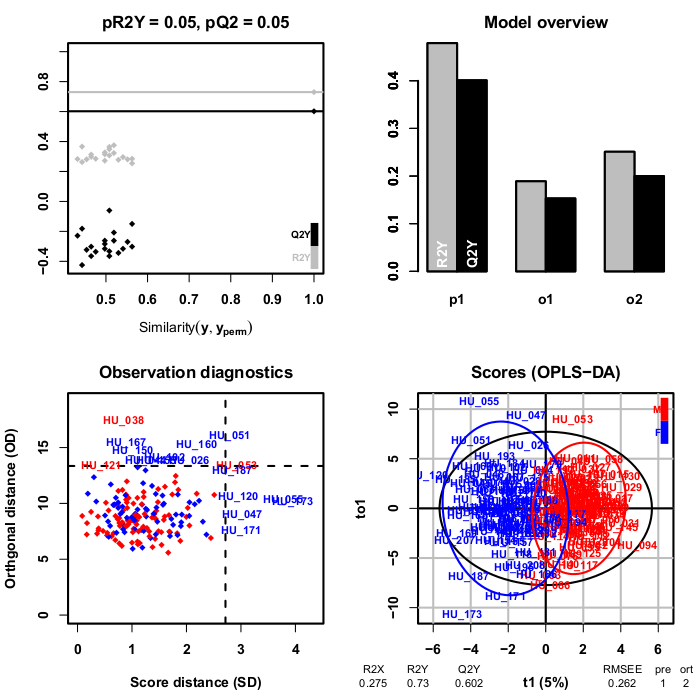

<!-- Guidance: see https://github.com/phnmnl/phenomenal-h2020/wiki/The-Guideline-for-Container-GitHub-Respository-README.md-Creation -->


# W4M Multivariate
Version: 2.3.10

## Short description

PCA, PLS(-DA) and OPLS(-DA) for multivariate analysis of omics data

## Description

**Latent variable modeling** with Principal Component Analysis (**PCA**) and Partial Least Squares (**PLS**) are powerful methods for **visualization**, **regression**, **classification**, and feature selection of **omics data** where the number of variables exceeds the number of samples and with multicollinearity among variables (Wold et al, 2001; Thenenhaus, 1998; Wehrens, 2011; Eriksson et al, 2006; Trygg et al, 2007). Orthogonal Partial Least Squares (**OPLS**) enables to separately model the variation correlated (predictive) to the factor of interest and the uncorrelated (orthogonal) variation (Trygg and Wold, 2002). While performing similarly to PLS, OPLS facilitates interpretation. Successful applications of these chemometrics techniques include spectroscopic data such as Raman spectroscopy, nuclear magnetic resonance (NMR), mass spectrometry (MS) in metabolomics and proteomics, but also transcriptomics data. In addition to **scores**, **loadings** and **weights** plots, the module provides metrics and graphics to determine the optimal number of components (e.g. with the **R2** and **Q2** coefficients; Wold et al, 2001; Thenenhaus, 1998; Eriksson et al, 2006), check the **validity of the model** by permutation testing (Szymanska et al, 2012), detect **outliers** (Wold et al, 2001; Thenenhaus, 1998; Hubert et al, 2005), and provide several metrics to assess the importance of the variables in the model (e.g. **Variable Importance in Projection** or regression coefficients; Wold et al, 2001; Mehmood et al, 2012; Galindo-Prieto et al, 2014). The module is an implementation of the **ropls** R package available from Bioconductor (Thevenot et al, 2015).

## Key features

- Multivariate statistics
- Principal Component Analysis
- Partial Least Squares
- Orthogonal Partial Least Squares

## Functionality

- Statistical Analysis

## Approaches

- Metabolomics / Targeted
- Metabolomics / Untargeted

## Data Analysis

- Multivariate statistics

## Screenshots



## Tool Authors

- [Étienne Thévenot](http://etiennethevenot.pagesperso-orange.fr) (CEA, LIST, MetaboHUB).

## Container Contributors

- Pierrick Roger (CEA).

## Website

- http://workflow4metabolomics.org

## Git Repository

- https://github.com/phnmnl/container-multivariate.git

## Installation 

For local individual installation:

```bash
docker pull docker-registry.phenomenal-h2020.eu/phnmnl/multivariate
```

## Usage Instructions

For direct docker usage:

```bash
docker run docker-registry.phenomenal-h2020.eu/phnmnl/multivariate ...
```

## Publications

<!-- Guidance:
Use AMA style publications as a list (you can export AMA from PubMed, on the Formats: Citation link when looking at the entry).
-->

- Thévenot EA, Roux A, Xu Y, Ezan E, Junot C. Analysis of the Human Adult Urinary Metabolome Variations with Age, Body Mass Index, and Gender by Implementing a Comprehensive Workflow for Univariate and OPLS Statistical Analyses. J Proteome Res. 2015;14(8):3322-35.
